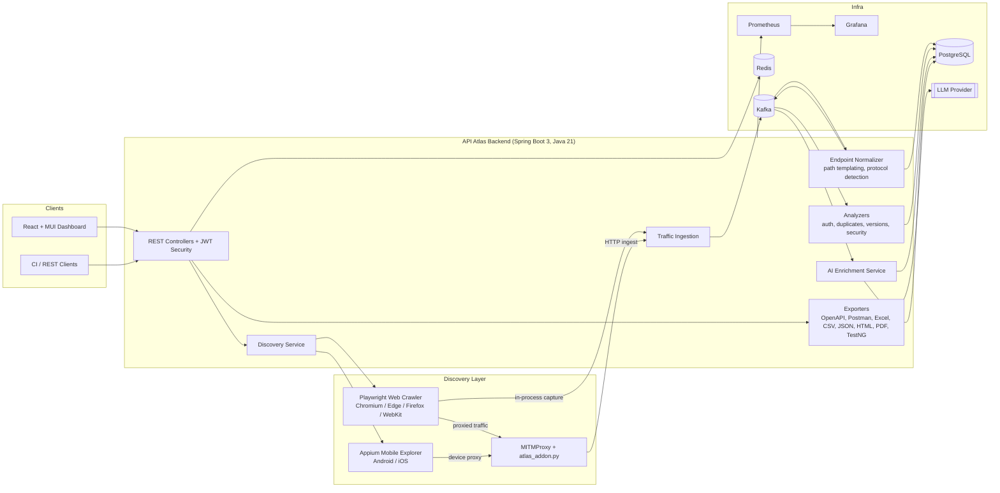
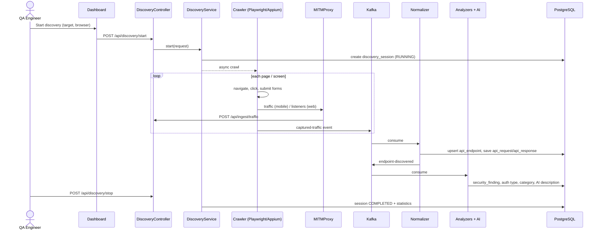
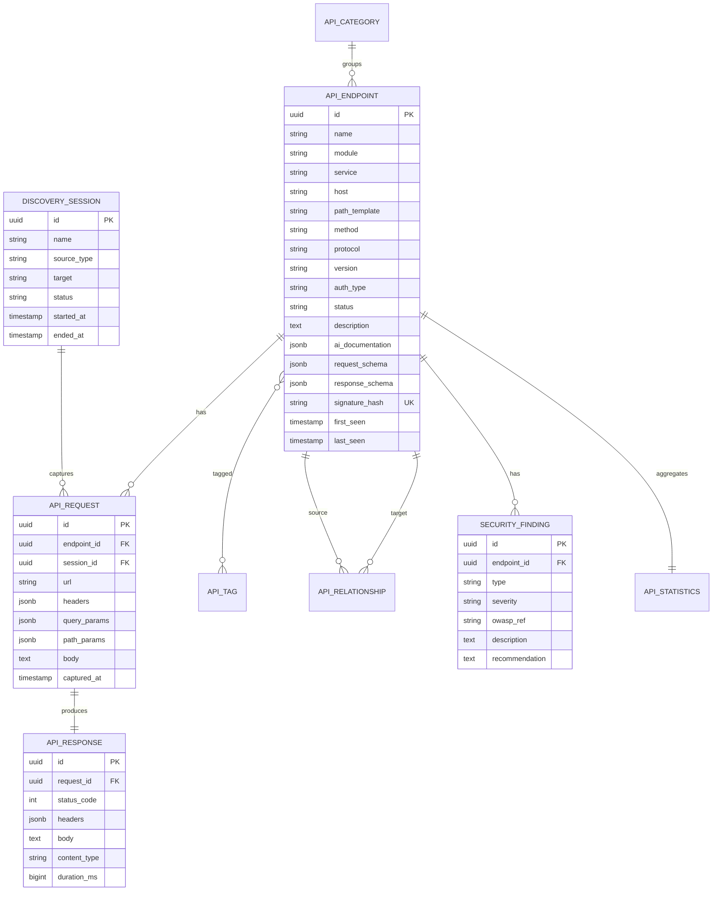

# API Atlas — System Architecture

> **Discover. Map. Document.**
> API Atlas is an AI-powered enterprise platform that automatically discovers, maps, documents, analyzes, and exports APIs from web and mobile applications without requiring source code access.

## 1. High-Level Architecture



## 2. Component Responsibilities

| Package | Responsibility |
|---|---|
| `config` | Spring configuration: Kafka topics, Redis cache, OpenAPI, async executors, typed properties |
| `controller` | REST API (`/api/apis`, `/api/statistics`, `/api/security`, `/api/export/*`, `/api/discovery/*`) |
| `service` | Business logic: catalog, statistics, discovery orchestration, ingestion |
| `repository` | Spring Data JPA repositories |
| `model` | JPA entities |
| `dto` | API contracts and Kafka event payloads |
| `crawler` | Playwright web crawler and Appium mobile explorer |
| `interceptor` | Traffic capture: Playwright listeners, MITMProxy ingestion, protocol detection |
| `analyzer` | Auth detection, duplicate/version/deprecation detection, security (OWASP API Top 10) |
| `exporter` | OpenAPI, Postman, Excel, CSV, JSON, HTML, PDF, REST Assured/TestNG generator |
| `security` | JWT authentication, filter chain, user management |
| `ai` | LLM client, prompt templates, endpoint enrichment |
| `utility` | Path templating, JSON schema inference, hashing, masking |

## 3. Discovery Sequence



## 4. ER Diagram



## 5. Delivery Phases

| Phase | Scope |
|---|---|
| **1** | Architecture, project structure, `pom.xml`, `application.yml`, application bootstrap |
| 2 | Database schema (Flyway), entities, repositories |
| 3 | Security (JWT), DTOs, catalog services and REST controllers |
| 4 | Traffic interception (Playwright listeners, MITMProxy addon + ingestion, Kafka pipeline) |
| 5 | Web crawler (Playwright) and mobile explorer (Appium) |
| 6 | Analyzers (auth, duplicates, versions, deprecation, security/OWASP) + AI enrichment |
| 7 | Exporters (OpenAPI, Postman, Excel, CSV, JSON, HTML, PDF) + REST Assured/TestNG generator |
| 8 | React + Material UI dashboard |
| 9 | Docker, docker-compose, Kubernetes, GitHub Actions, Prometheus/Grafana |
| 10 | Installation Guide and User Guide |

## 6. Project Structure

```
APIAtlas/
├── pom.xml
├── docs/                         # architecture, installation, user guide
├── mitmproxy/atlas_addon.py      # traffic forwarder (phase 4)
├── frontend/                     # React + MUI (phase 8)
├── deploy/{docker,k8s,monitoring}
├── .github/workflows/ci.yml
└── src/main/java/com/apiatlas/
    ├── ApiAtlasApplication.java
    ├── config/  controller/  service/  repository/  model/  dto/
    ├── crawler/  analyzer/  interceptor/  exporter/
    ├── security/  ai/  utility/
    └── src/main/resources/{application.yml, db/migration}
```
