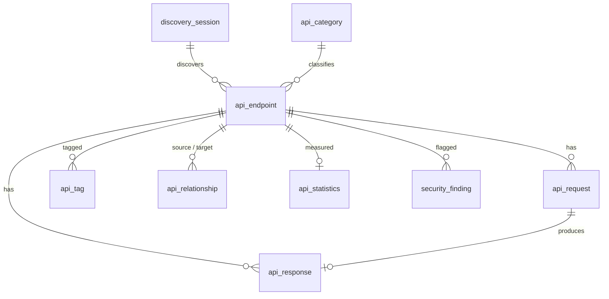

# API Atlas Database Design (PostgreSQL)

Schema is managed by Flyway: `src/main/resources/db/migration/V1__init_schema.sql`. Hibernate runs with `ddl-auto: validate`.
Foreign keys are plain `bigint` columns in the entities (no JPA associations) to keep queries and exports simple.

## Tables
| Table | Purpose | Key columns |
|---|---|---|
| `discovery_session` | one discovery run | type (WEB/MOBILE), status, target, pages_visited, endpoints_found, started_at, ended_at |
| `api_category` | business function | name (unique) |
| `api_endpoint` | catalog entry, unique on (method, service, path) | url, path (normalized, e.g. `/users/{id}`), version, protocol, auth_type, status, third_party, AI text columns, samples, hit_count, first_seen, last_seen |
| `api_request` | captured request history (max 25 per endpoint) | headers (masked JSON), query_params (masked JSON), cookies (names only), body (masked) |
| `api_response` | captured response history | status_code, headers, body, content_type, response_time_ms |
| `api_tag` | tags per endpoint | unique (endpoint_id, tag) |
| `api_relationship` | observed call sequences | type `CALLED_AFTER`, weight |
| `api_statistics` | rolling per-endpoint metrics | call_count, error_count, avg_response_ms, max_response_ms |
| `security_finding` | security issues | category, owasp, severity, title, description, resolved; unique (endpoint_id, category) |

## ER diagram

## Enumerations (stored as strings)
- protocol: REST, GRAPHQL, SOAP, GRPC, WEBSOCKET, SSE
- auth_type: NONE, BASIC, JWT, OAUTH2, API_KEY
- status: ACTIVE, DEPRECATED, UNUSED
- severity: INFO, LOW, MEDIUM, HIGH, CRITICAL
- session status: RUNNING, COMPLETED, STOPPED, FAILED

## Data protection
Secrets are masked before insert (see [SECURITY.md](SECURITY.md)). Endpoints and history are removed with `on delete cascade`.
